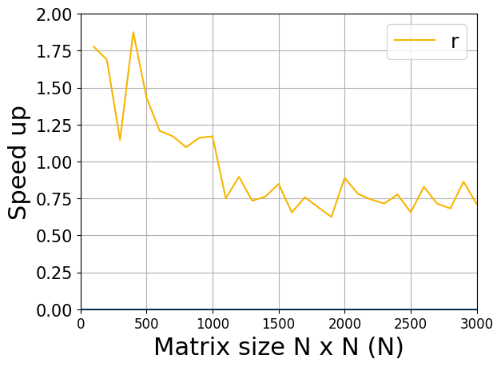

# Batched Kronecker Product Test
cupyで性能差が見られなかったので生CUDAで書いてみようと

## ファイル
- kp.py : BatchedKroneckerProductのPythonのコード 
- main.cu : BatchedKroneckerProductの生CUDAのコード

## Cupyの問題点

- matmulで呼んでいるcublasSgemmの転置引数がCUBLAS\_OP\_Nで固定されている  
→ 転置した行列の積を計算したければtranspose()を呼ばなくてはいけない  
→ cupy.copyが呼ばれる(無駄)

- cudaMemsetがいたるところで呼ばれている  
→ この処理が重いのでクロネッカー積をバッチ処理しても差が出ない

### 解決法
- cublasSgemmを直接呼ぶ→転置の問題は解決
- cupy使わない(chainerもできれば使わない)→面倒
- ボトルネックでなければ無視→願う


## 実験
生CUDAで

### 環境
- GF GTX 1080

### 結果
#### バッチ処理
```
行列サイズ : 100 x 100
バッチサイズ : 5000
計算回数 : 100
計算時間 : 34.81[ms]
```
#### forループ
```
行列サイズ : 100 x 100
バッチサイズ : 5000
計算回数 : 100
計算時間 : 46.97[ms]
```

だいたいこんな感じ  
生だとバッチ処理が期待通り速いっぽい

### 高速化率
- バッチサイズ : 5000
- 計算回数 : 100
- 行列サイズ : 変化



## 思ったこと
- 計算する行列のサイズが小さいと沢山並列できるのかな
- streamの上限はGPUごとに違いそう
